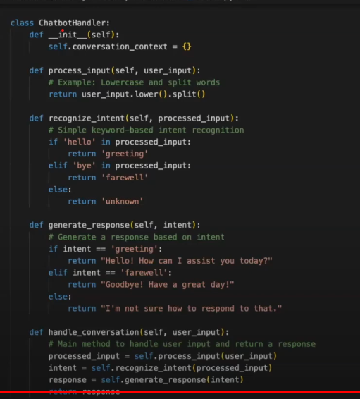

## Probability in NLP and Chatbots (Bayesian Rule)

### Importance of Probability

    - Probability measures the likelihood of an event happenining
    - In Nlp it is used to estimate workds, phrases or intents.

### Types of probability mofels
    - Unigram model - probability of individual words
    - Bigram/Trigram Model - Word sequences (groups of words)
    - NGram model - predict the likelihood of a sequence of words appearing together

### Bayesian rule
    - A methof to calculate the probability of an event based on prior knowledge.
    - Ex. Updates the prob of an event occuring based on new evidence

### Formula (REVIEW)
    
    - P(A\B) = P(B/A)P(A)    / P(B)

    P(A) - Prior Probability
    P(B/A) - Likelihood  


### Applying to Chatbots
    - Intial estimate of the users intent
    - Likelihood - prob of observing the users input given the intent
    - Posterior Probability - updates prob of the intent after considering the input

### Example
    - Scenario : "How can I reset my password?
    - Prior - The bot assigns a prior probability of 0.6 to 'information-seeking' intent (Meaning that the bot analyzed the user is asking a question)
    - likelihood - intent is increased to 0.9 by pairing words "How can I reset" (Ngram Model) 
    - Posterior - After applying Bayesian Rule, bot updates prob to 0.85


### Section II (Chatbot Handler)
-----

    - A centralized class that manages chatbot logic, input handling and response generation

    - purpose - Encapsulates the chatbots behavior, making it easier to maintain, extend and sclae

    - components - input processing, intent recognition, response generation.

### why???

    - It keeps input processing, logic, and responses separate.
    - Scalability - males the chatbot easier to extend as you add new intents or features.
    -Maintainability - A well organized handler simplifies debugging and future enhancements.

### Core components in a chatbotHandler
     
```
def process_input(self,user_input)
    ## Handles the input from the user

def recognize_intent(self, processed_input)
    #Identifites the user's intent

def generate_response(self, intent)
    # Generates an appropriate response

def mange_flow(self)
    Keeps track of conversation context and flow
```

## Example code

    
    
### Handling multiple intents and complex conversations

- Extending the chatbothandler
    - Context awareness: Track conversation context to provide relevant response
    - incorporate NLP models for better intent recognition
    - Support for multiple intents 'information-seeking' commands

